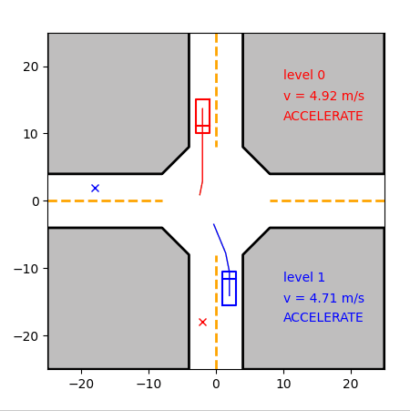
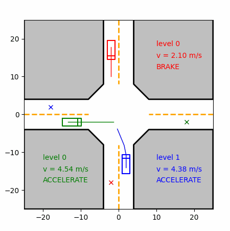
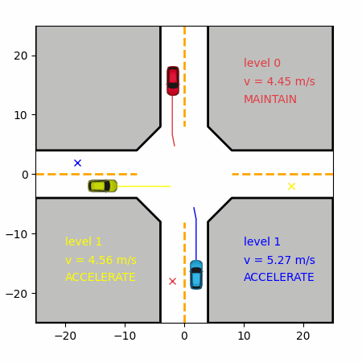

# Vehicle Interaction Decision Making

The repository implements the decision-making of multiple vehicles at intersections based on level-k game, and uses MCTS to accelerate search. The code is fully implemented in C++ and Python respectively. 

<div align=center>
  <tr>
    <td></a></td>
    <td></a></td>
  </tr>
</div>

## How to run🏃‍♂️

Clone the repository to local path:

```shell
git clone git@github.com:PuYuuu/vehicle-interaction-decision-making.git
```

The following is the development and testing environment of this repository , for your information:

- **System:** Ubuntu 20.04 ( WSL2 )
- **Python 3.8.10:** numpy == 1.24.4  matplotlib == 3.7.4
- **C++ Toolchain:** GCC 9.4.0 CMake 3.23.0

### 🐍Run using Python

#### 1.1.1 Requirement

Make sure your python version is 3.6.12 or above. Then use the following instructions to install the required third-party libraries, or install them manually.

```shell
pip install -r scripts/requirements.txt
```

#### 1.1.2 Run it

Firstly, you can run it directly using the default parameters.

```shell
python scripts/run.py
```

Or specify parameters for example:

```shell
python scripts/run.py -r 5 --log_level debug --config ./config/triple_interact.yaml
```

For detailed usage help, use `python scripts/run.py -h` to view.

### 🦈Run using C++

Running C++ requires python dependencies, refer to **1.1.1**. By the way, **the C++ implement of this repository is more than 10 times faster🚀 than the Python**. Therefore, strongly recommend you do further development on the basis of C++.

#### 1.2.1 Requirement

1. Install `eigen3` for matrix calculation, `fmt` for string format , and `spdlog` for log print :

```shell
sudo apt update
sudo apt install libeigen3-dev libspdlog-dev libfmt-dev
```

2. Install  `yaml-cpp` for parsing yaml file :

```shell
git clone https://github.com/jbeder/yaml-cpp.git
cd yaml-cpp
mkdir build && cd build
cmake -DBUILD_SHARED_LIBS=ON ..
make -j6
sudo make install
```


#### 1.2.2 Build and run

```shell
cd ${path_to_project}
mkdir build && cd build
cmake .. && make -j6
./decision_making
```

More usage information can be found through `./decision_making -h` or code.

### 🛠Configure parameters

The configuration file of program running parameters is in `${Project}/config`. The default parameters can be used directly, and you can also change them according to your needs, such as changing the vehicle drawing style:

```yaml
# vehicle_display_style: "linestyle"
vehicle_display_style: "realistic"
```
<div align=center>
  <tr>
    <td></a></td>
  </tr>
</div>

## Reference📝

1. *Game Theoretic Modeling of Vehicle Interactions at Unsignalized Intersections and Application to Autonomous Vehicle Control* [[link]](https://ieeexplore.ieee.org/abstract/document/8430842)
2. *Receding Horizon Motion Planning for Automated Lane Change and Merge Using Monte Carlo Tree Search and Level-K Game Theory*  [[link]](https://ieeexplore.ieee.org/document/9147369)
