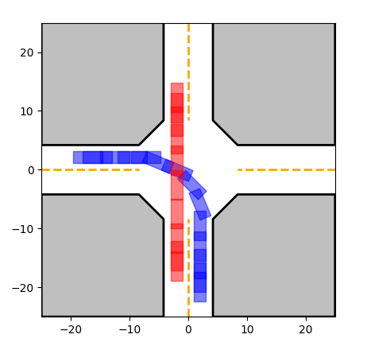

# Vehicle Interaction Decision Making

The repository implements the decision-making of multiple vehicles at intersections based on level-k game, and uses MCTS to accelerate search. The code is fully implemented in C++ and Python respectively. 



## How to run🏃‍♂️

Clone the repository to your local path:

```shell
git clone git@github.com:PuYuuu/vehicle-interaction-decision-making.git
```

The following is the development and testing environment of this repository , for your information:

- **System:** Ubuntu 20.04 ( WSL2 )
- **Python 3.8.10:** numpy == 1.24.4  matplotlib == 3.7.4
- **C++ Toolchain:** GCC 9.4.0 CMake 3.23.0

### 🐍Run using Python

#### 1.1.1 Requirement

Make sure your python version is 3.6.12 or above. Then use the following instructions to install the required third-party libraries, or install them manually.

```shell
pip install -r scripts/requirements.txt
```

#### 1.1.2 Run it

Firstly, you can run it directly using the default parameters.

```shell
python scripts/run.py
```

Or manually specify parameters for example:

```shell
python scripts/run.py -r 5 --log_level debug --save_fig
```

For specific parameter descriptions, please use `python scripts/run.py -h` to view.

### 🦏Run using C++

Running C++ requires python dependencies (1.1.1)

#### 1.2.1 Requirement

1. Install `fmt` for string formatting , `spdlog` for log printing :

```shell
sudo apt update
sudo apt install libspdlog-dev libfmt-dev
```

2. Install  `yaml-cpp` for parsing yaml file :

```shell
git clone https://github.com/jbeder/yaml-cpp.git
cd yaml-cpp
mkdir build && cd build
cmake -DBUILD_SHARED_LIBS=ON ..
make -j6
sudo make install
```

3. Install `matplotlib-cpp` for visualization :

```shell
git clone git@github.com:lava/matplotlib-cpp.git
```

Then replace the ***get_array()*** and ***text()*** functions in `matplotlibcpp.h` :

```c++
template<typename Numeric>
PyObject* get_array(const std::vector<Numeric>& v)
{
    npy_intp vsize = v.size();
    NPY_TYPES type = select_npy_type<Numeric>::type;
    if (type == NPY_NOTYPE) {
        size_t memsize = v.size()*sizeof(double);
        double* dp = static_cast<double*>(::malloc(memsize));
        for (size_t i=0; i<v.size(); ++i)
            dp[i] = v[i];
        PyObject* varray = PyArray_SimpleNewFromData(1, &vsize, NPY_DOUBLE, dp);
        PyArray_UpdateFlags(reinterpret_cast<PyArrayObject*>(varray), NPY_ARRAY_OWNDATA);
        return varray;
    }
    
    _import_array();
    PyObject* varray = PyArray_SimpleNewFromData(1, &vsize, type, (void*)(v.data()));
    return varray;
}

template<typename Numeric>
void text(Numeric x, Numeric y, const std::string& s = "", const std::map<std::string, std::string>& keywords = {})
{
    detail::_interpreter::get();

    PyObject* args = PyTuple_New(3);
    PyTuple_SetItem(args, 0, PyFloat_FromDouble(x));
    PyTuple_SetItem(args, 1, PyFloat_FromDouble(y));
    PyTuple_SetItem(args, 2, PyString_FromString(s.c_str()));

    // construct keyword args
    PyObject* kwargs = PyDict_New();
    for (auto it = keywords.begin(); it != keywords.end(); ++it) {
        PyDict_SetItemString(kwargs, it->first.c_str(), PyUnicode_FromString(it->second.c_str()));
    }

    PyObject* res = PyObject_Call(detail::_interpreter::get().s_python_function_text, args, kwargs);
    if(!res) throw std::runtime_error("Call to text() failed.");

    Py_DECREF(args);
    Py_DECREF(kwargs);
    Py_DECREF(res);
}
```

Copy the `matplotlib-cpp` folder to the system directory, such as `/usr/local/include`.

#### 1.2.2 Build it

```shell
cd ${path_to_project}
mkdir build && cd build
cmake ..
make -j6
```

#### 1.2.3 Run it

The executable file can be found in the build folder, run it directly using the default parameters:

```shell
./decision_making
```

More usage information can be found through `-h` or code.

### 🛠Configuration file usage

The configuration file of program running parameters is in `${Project}/config` and strictly uses the yaml file format.

## Reference📝

1. *Game Theoretic Modeling of Vehicle Interactions at Unsignalized Intersections and Application to Autonomous Vehicle Control* [[link]](https://ieeexplore.ieee.org/abstract/document/8430842)
2. *Receding Horizon Motion Planning for Automated Lane Change and Merge Using Monte Carlo Tree Search and Level-K Game Theory*  [[link]](https://ieeexplore.ieee.org/document/9147369)
